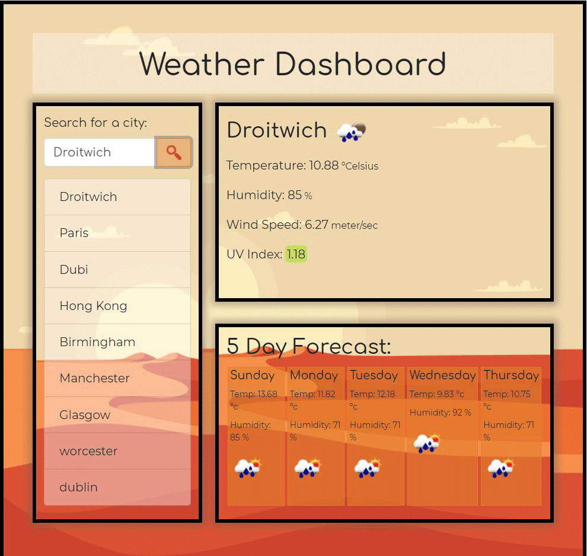
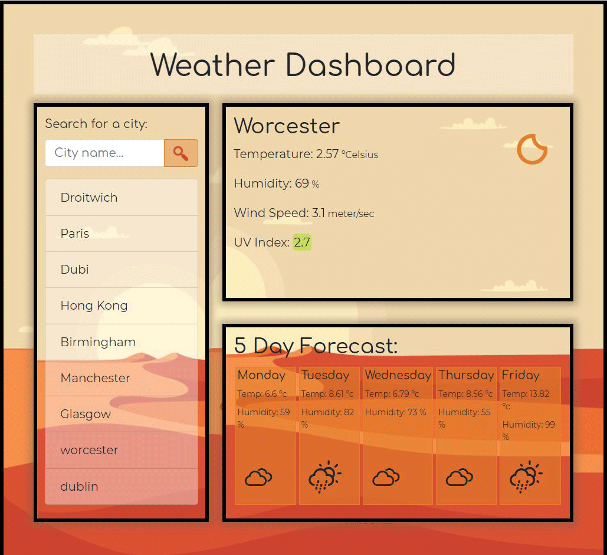
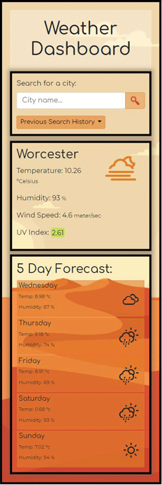
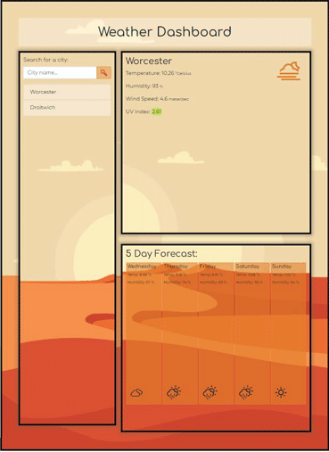
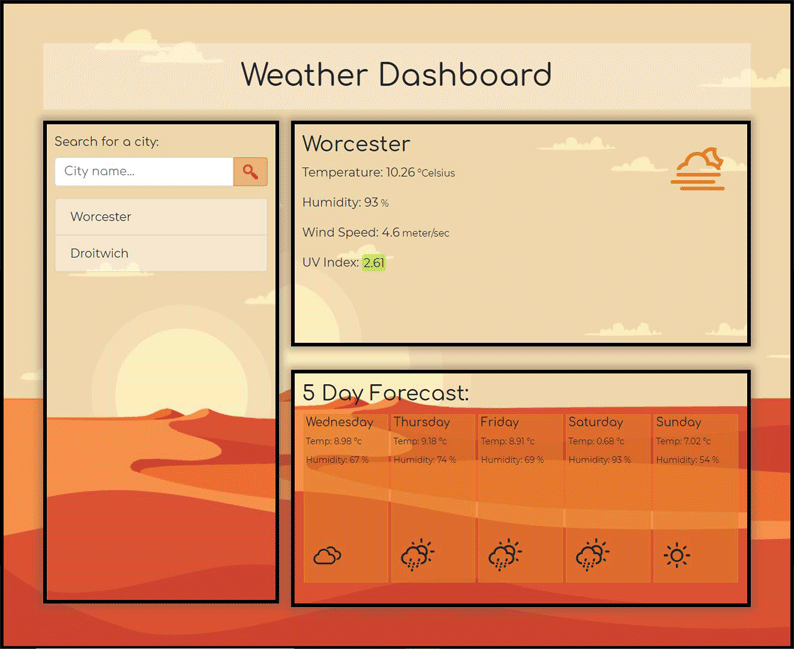

# My Weather Dash 

## Description

The weather dashboard was created from the open weather API to display the current day’s temperature, humidity, windspeed, UV index, and weather symbol. It should then display a 5 day forecast with date temperature, humidity and symbol. 

The searches are made by the user by city name in an input field and the search is saved. The searches are saved and displayed on screen after the user inputs a search and on page re-load. 
The users can select the searches in the history list to re display the searches for that city, current and future. 
When the UVindex is displayed it is shown with a colour representation of the severity of the exposure. 

## Contents: 
1. Installation 
2. Usage
3. Improvements
4. Updates
5. Credits
6. License

## Instalation

You can view the weather dashboard via this link to [Github pages](https://samwakelam.github.io/06_WEATHER_DASH_SLW/)

Or find the code on the [Repository](https://github.com/Samwakelam/06_WEATHER_DASH_SLW). 

## Usage

Search your chosen city from the input field in the aside. 

Your chosen city is displayed in the top article withthe current weather for that day, below is the 5 day forecast. 

Your chosen city will also be displayed in a list below the form as search history which can be called at another time. 

In addition improved usage that I have added:
* You can search in any case and the saved searches will display in sentence case. 

* There is a limit on saved searches. If you exceed this limit your oldest search is knocked off the search history list. 

* The search History is displayed most recent search at the top. 

## Improvements

I need to improve the responsiveness of the layout for smaller screens. 

I want to improve on the symbol graphics, they are a little basic. 

A really neat feature would be to change the background with the time of day or type of weather.

## Updates 

(Update 25/10/2020) Icons updated using Weather Icons 222 Weather Themed Icons and CSS. (Flowers,E. Bischoff,L.(2017).Weather Icons 222 Weather Themed Icons and CSS). erikflowers.github.io. https://erikflowers.github.io/weather-icons/.)

(Update 26/10/2020) Media Querys improved, slight discrepencies in the finishing of a couple of the divs, struggling to iron out, over all the background remains covered and all content is displayed. 
History list converts to a dropdown menu when the screen is smaller. 

(Update 10/11/2020) Homework Feedback #1 has been resolved. Dropdown menu shows single search result and doe not duplicate. You cannot search an empty string, the placeholder text will alert you to this if you try. The last searched city is displayed on your return. 

## Credits 

Thanks go out to Colum Lynagh and Andy for helping me overcome issues with overwritting the local storage. 

Resources I have referenced:   
W3Schools  
StackOverflow  
freecodecamp 

## License 

I have drawn the graphics myself and they are copyright 2020. No useage without permission. 

Please feel free to make suggestions and improvement on the workings of the quiz and use the code as a base for your own if you wish. you must make reference where the code originated if you do. I would also love to see what changes and improvements you make.  

Design by Samantha Wakelam, please respect copyright 2020. 

 
